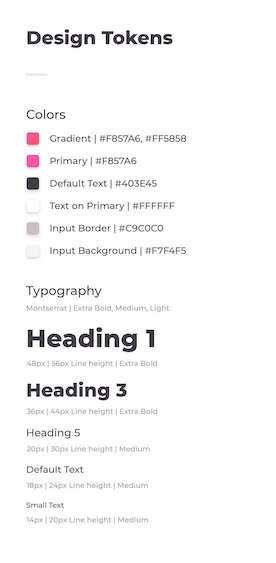
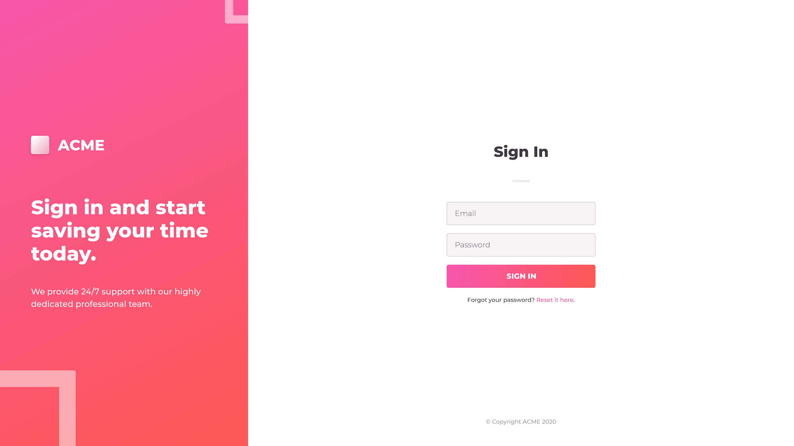
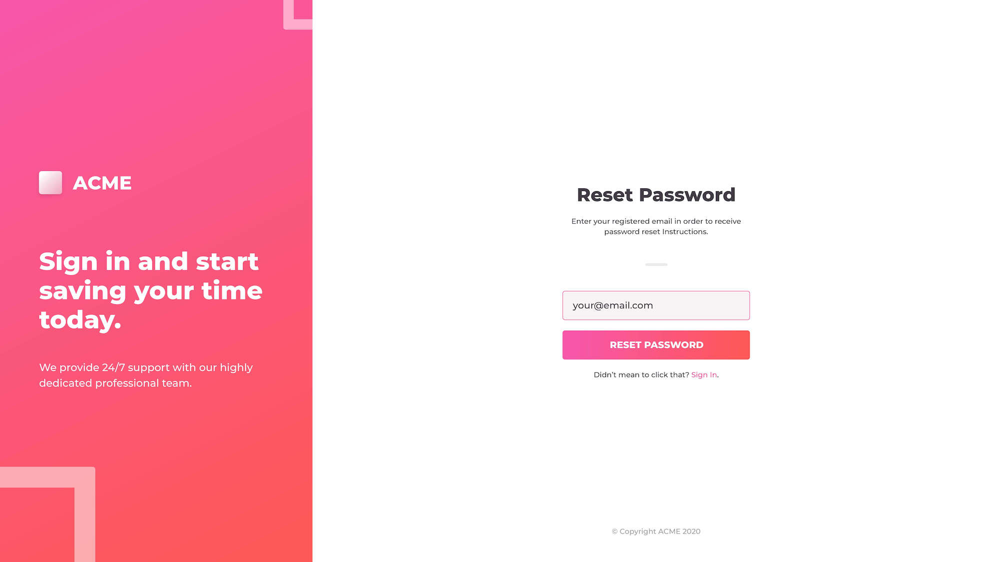
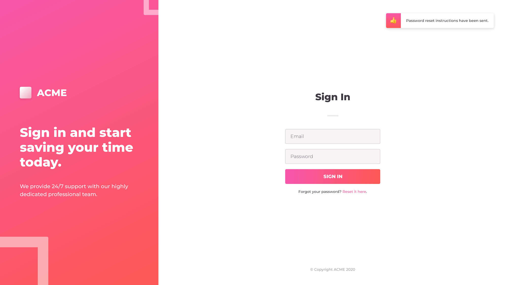
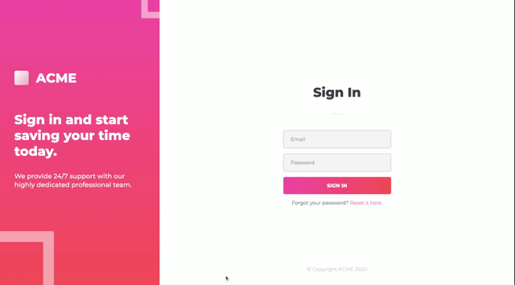

# React Test

[Deploy Link](https://www.natemking.dev/react_test/#/)

## Description
This repo is a React test that was found on a webdev forum and sent to me by a colleague. The goal is to complete in 3 hours but I chose to take as much time as I needed to complete the challenge in hopes to keep my React skills honed. This test also calls for a CSS-in-JS framework which I have never used. I choose Styled-Components as my CSS-in-JS framework.

### Instructions
#### _UI/UX Engineer Challenge_
Implement the provided app design using modern best practices for front-end web development. The expected flow is _Login Screen → Forgot Password → <Submit> → Login Screen with dismissible notification_. The primary areas of evaluation are code composition and attention to aesthetic detail. Please use React, React hooks, and your favorite CSS-in-JS framework to do the styling. Feel free to use an additional javascript libraries that will improve legibility of the code.

_Design Tokens_

_Design Mockup_

### Final Product

_Final Product Gif_

---

GitHub: [@natemking](https://github.com/natemking/)

Email: [natmeking@gmail.com](mailto:natmeking@gmail.com)

